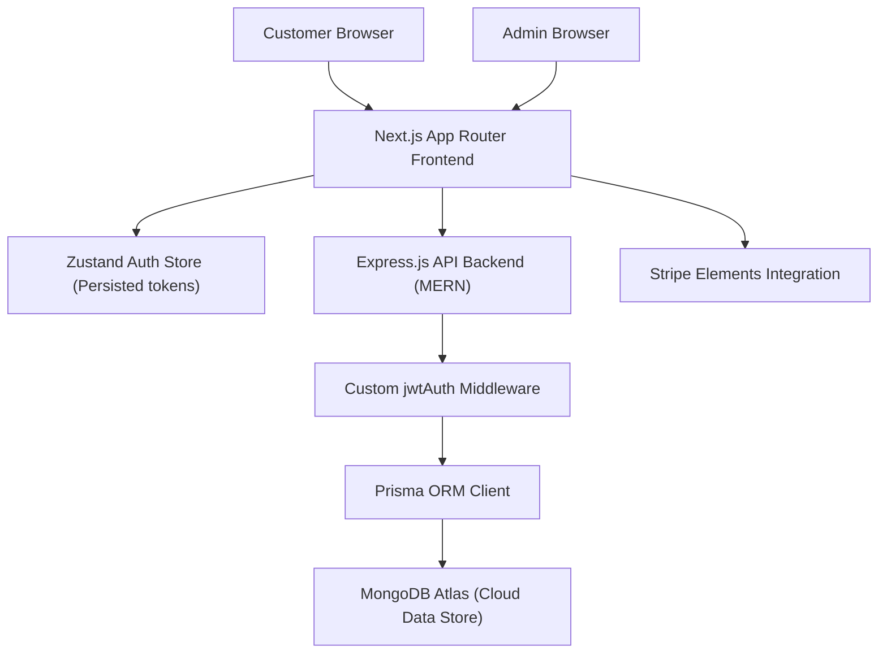

# 🛒 Arslan Electronics - Premium 3D Full-Stack eCommerce Solution

[](https://full-stack-electronics-e-commerce-s.vercel.app/)
[](https://nextjs.org/)
[](https://www.prisma.io/)
[](https://www.mongodb.com/atlas)
[](https://threejs.org/)

**Arslan Electronics** is an immersive, premium, high-performance electronics e-commerce platform. Leveraging hardware-accelerated **Three.js WebGL particles**, live ticking sci-fi HUD telemetry, a multi-step checkout wizard with integrated secure **Stripe payment elements**, a highly visual custom Admin dashboard with revenue analytics, and role-based MERN JWT authentication, it delivers an Apple/Tesla-style high-end user experience.

---

## 🚀 Live Portal URL
Experience the live optimized production application here:  
👉 **[https://full-stack-electronics-e-commerce-s.vercel.app/](https://full-stack-electronics-e-commerce-s.vercel.app/)**

---

## 🏗️ Architectural Flow



---

## 🌌 Core Features & Innovations

### 🛰️ Apple/Tesla-style Immersive Experience
*   **WebGL Particle System**: Built a hardware-accelerated [Three.js](https://threejs.org/) particle constellation sphere with interactive gravity fields responsive to cursor coordinates.
*   **Holographic HUD**: Ticking digital sensor grids displaying real-time telemetry (CPU frequencies, latency metrics, and network loads).
*   **Active Laser Scanning**: Seamless glassmorphic panels animated with moving glowing neon green laser scanner lines.

### 🛡️ Custom MERN JWT Authentication
*   **Secure Session Validation**: Replaced Supabase with unified role-based Access and Refresh tokens stored securely in a local persistent Zustand store.
*   **Secure Router Protection**: Full client and server-side middleware checking authentication status on checked out forms and dashboard.

### 💳 professional Payment wizard
*   **Stripe Elements Integration**: SECURE card elements wrapping checkout reviews to process tokens securely.
*   **Transaction Syncing**: Captures full order objects and syncs payment statuses instantly to MongoDB.
*   **Promotional Coupons**: Live input fields allowing customers to validate and apply discounts before paying.

### 🎛️ Sleek Buyer Panel Dashboard
*   **Interactive Orders Timeline**: Displays active orders with real-time progress indicators: `Pending` ➔ `Processing` ➔ `Shipped` ➔ `Delivered`.
*   **Integrated Wishlist Module**: Direct add-to-cart or delete actions rendering on a unified page.
*   **Corporate Invoice Creator**: Renders highly professional printable invoice layouts right in the order history log.

### 📊 Visual Admin Command Center
*   **Vibrant SVG Analytics**: Gorgeous monthly revenue growth graphics and product category distribution indicators.
*   **Promo Coupon Manager**: Admins can generate randomized promo codes, select discount levels up to 50%, and review existing promo campaigns.
*   **Review Moderation Portal**: Moderate incoming product ratings, check feedback descriptions, and approve or delete comments instantly.

---

## 🛠️ Technology Stack

*   **Frontend Engine**: Next.js 16 (App Router), React 18, TypeScript, Three.js (WebGL)
*   **Backend Server**: Node.js, Express.js (Role Authorization Middleware)
*   **Database & ORM**: MongoDB Atlas, Prisma Client
*   **Styling & Themes**: Tailwind CSS, DaisyUI (Custom Class Light/Dark Mode)
*   **State Containers**: Zustand (Synchronized local storage)

---

## ⚙️ Quick Installation

### 1. Clone the repository
```bash
git clone https://github.com/Arslan-web-Dev/full-stack-Electronics-eCommerce-Shop.git
cd full-stack-Electronics-eCommerce-Shop
```

### 2. Configure Environment `.env`
Create a `.env` file in the root directory:
```env
DATABASE_URL="mongodb+srv://<user>:<password>@cluster0.mongodb.net/arslan-shop"
NEXT_PUBLIC_STRIPE_PUBLISHABLE_KEY="pk_test_..."
STRIPE_SECRET_KEY="sk_test_..."
JWT_SECRET="your_hyper_secure_secret"
```

### 3. Install Dependencies & Seed Database
```bash
# Install frontend packages
npm install

# Seed Prisma client
npx prisma generate
npx prisma db push

# Start development frontend
npm run dev
```

### 4. Launch Backend API Server
```bash
cd server
npm install
npm run start
```

## 🔐 Portal Test Credentials

Use these pre-configured, pre-verified accounts to test role-based access:

### 👑 1. Admin Account (Full inventory CRUD, Coupon management, and review moderating)
*   **Email**: `admin@arslanelectronics.com`
*   **Password**: `AdminPassword123`

### 👤 2. Standard Buyer Account (Checkout, Dashboards, and Invoice Printing)
*   **Email**: `user@arslanelectronics.com`
*   **Password**: `UserPassword123`

---

## 👨‍💻 Developed By
**Muhammad Arslan**  
*Lead Full-Stack Visual Software Engineer*  

Specializing in high-performance web applications, serverless computing, and WebGL immersive creations.  
*   **Contact Support**: [WhatsApp Support](https://wa.me/923275541708)
*   **Creator Profile**: [/creator](https://full-stack-electronics-e-commerce-s.vercel.app/creator)

---

## 📜 License
This project is licensed under the MIT License.
