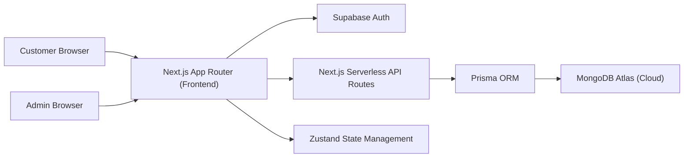
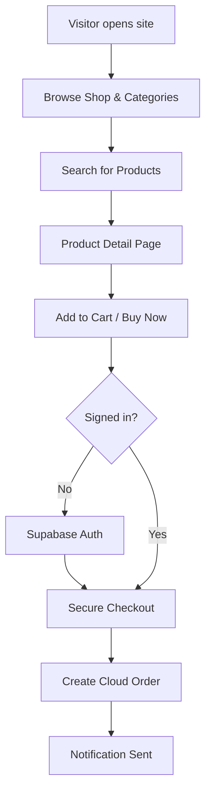
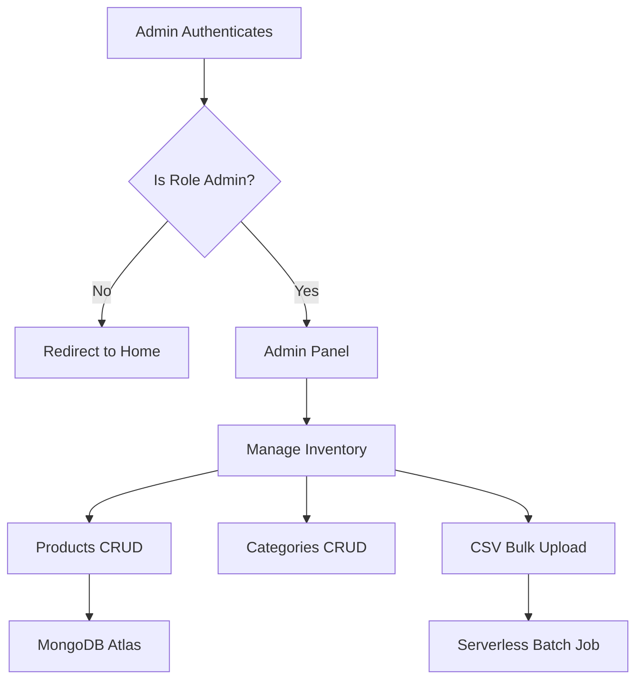
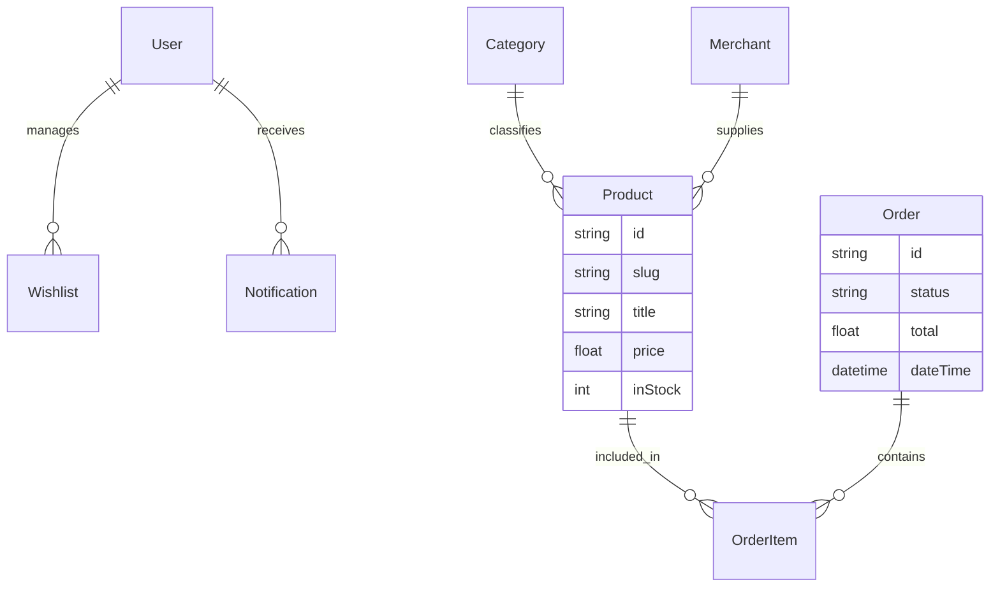

# 🛒 Arslan Electronics - Full-Stack eCommerce Solution

**Arslan Electronics** is a premium, high-performance electronics e-commerce platform designed for the Pakistani market. Built with a modern tech stack, it offers a seamless shopping experience, robust admin controls, and cloud-native architecture.

---

## 🚀 Live URL
Check out the production build here:  
**[https://full-stack-electronics-e-commerce-s.vercel.app/](https://full-stack-electronics-e-commerce-s.vercel.app/)**

---

## 🏗️ Modern Serverless Architecture

---

## 📋 Core Functionalities

### 🛍️ Customer Experience
- **Smart Catalog**: Real-time product browsing with category-wise segregation.
- **Dynamic Filtering**: Instantly filter by Price, Rating, and Stock availability.
- **Search Engine**: Robust search functionality with mode-insensitive matching.
- **User Dashboard**: Personalized wishlist, order history, and notification center.
- **Checkout Engine**: Secure multi-step checkout process with email validation.

### 🛡️ Admin Powerhouse
- **Real-time Monitoring**: Track sales and order statuses from a protected dashboard.
- **Inventory Management**: Full CRUD for Products, Categories, and Merchants.
- **Bulk Import Service**: Batch process thousands of products via CSV automation.
- **User Control**: Manage user roles and permissions directly from the portal.

---

## 🔄 Application Flows

### Shopping Journey

### Admin Management

---

## 📊 Data Model (Cloud Schema)

---

## 🛠️ Tech Stack

- **Frontend**: Next.js 15 (App Router), React 18, TypeScript
- **Styling**: Tailwind CSS, DaisyUI (Premium Themes)
- **Database**: MongoDB Atlas (Cloud)
- **ORM**: Prisma
- **Auth**: Supabase (JWT & Session based)
- **State Management**: Zustand

---

## 👨‍💻 Developed By

**Muhammad Arslan**  
*Lead Full-Stack Developer*

Specializing in building high-performance, scalable web applications for businesses.  
**Contact:** [WhatsApp Support](https://wa.me/923275541708) | [Creator Profile](https://full-stack-electronics-e-commerce-s.vercel.app/creator)

---

## 📜 License

This project is licensed under the MIT License.
